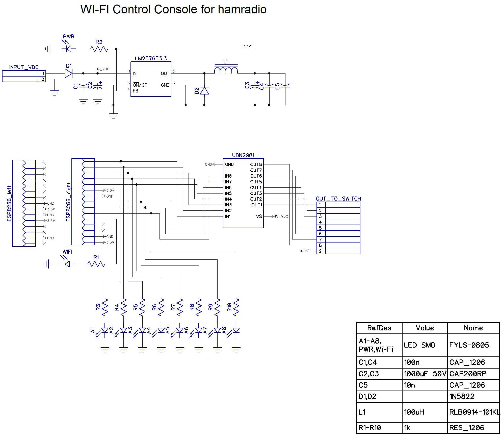
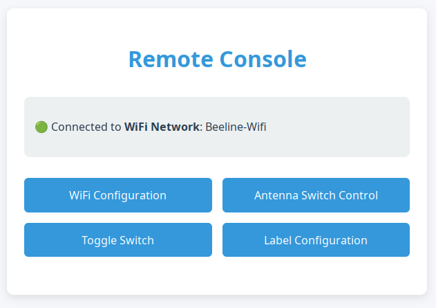
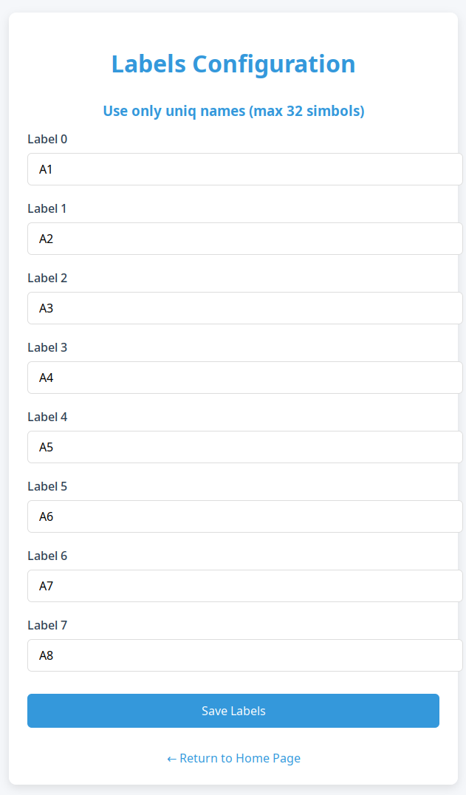
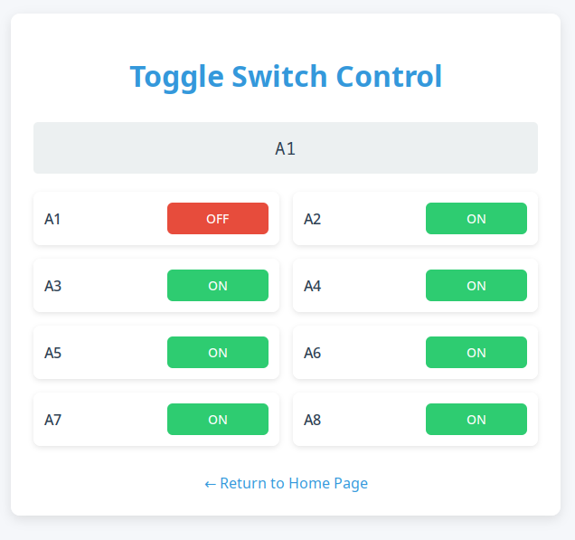
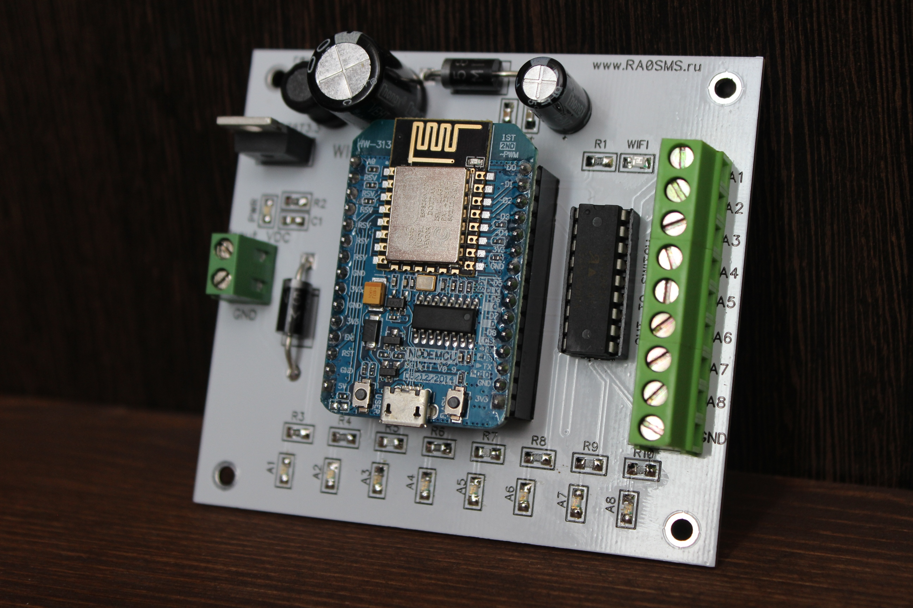
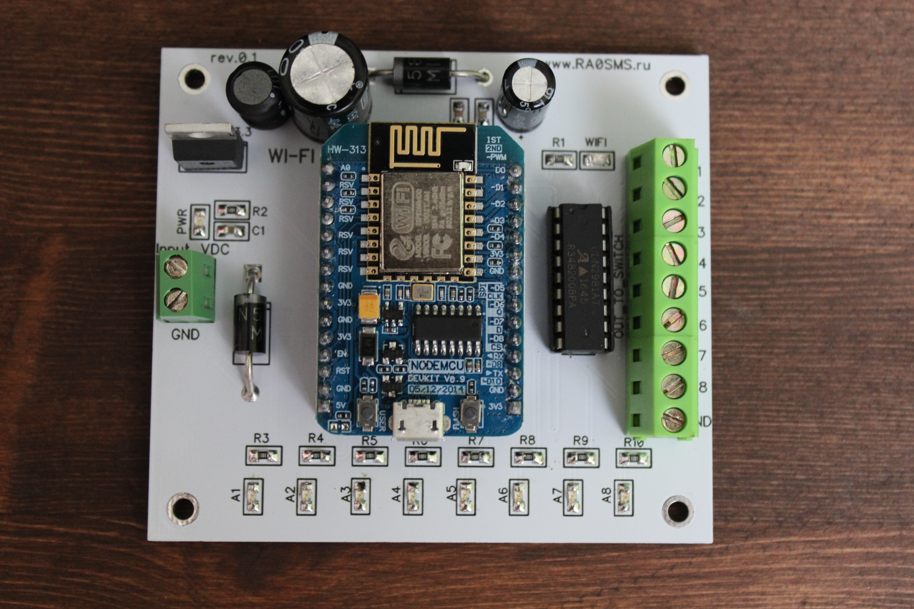
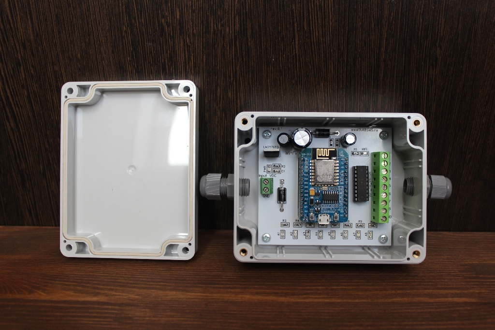

## WI-FI control console for antenna switches

[Manual in English](docs/Manual_console_en.pdf)

[Manual in Russian](docs/Manual_console_rus.pdf)

Source codes for server and client in ```src``` folder (Arduino IDE sketch).

The console schematic:




WEB UI:










Some photos:






